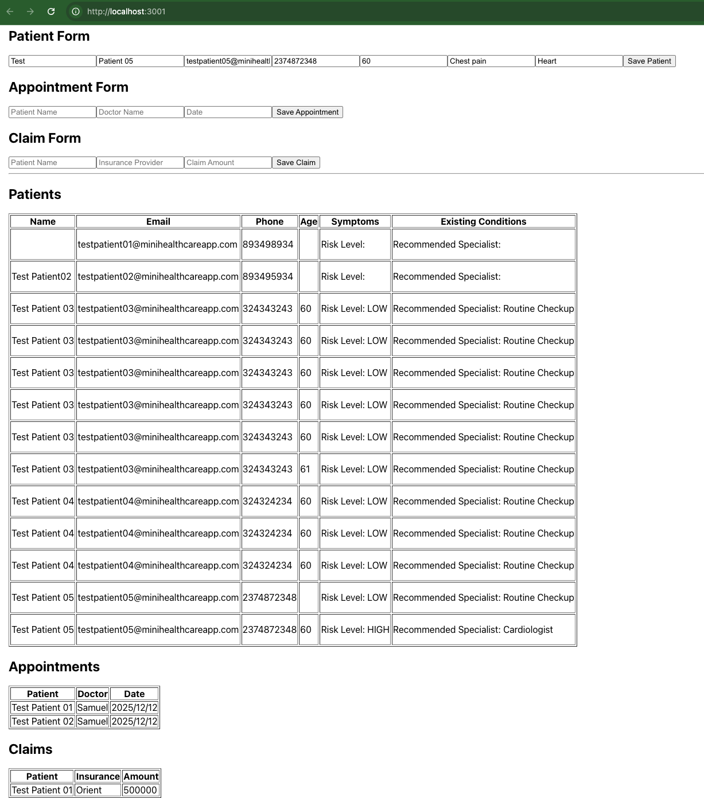

# MiniHealthcareApp
This repository is a test demo for automating test cases on a Healthcare application. The repo is not a final version of any testing frameworks.

# Project Screenshot


# Project Structure 

```healthcare-demo/                        # repo root (or keep as separate repos)
├── minihealthcare-app/                 # Full-stack app (backend + frontend)
├── backend/
│   ├── package.json
│   ├── server.js
│   ├── .env
│   │
│   ├── config/
│   │   └── db.js
│   │
│   ├── models/
│   │   ├── Patient.js
│   │   ├── Appointment.js
│   │   └── Claim.js
│   │
│   └── routes/
│       ├── patientRoutes.js
│       ├── appointmentRoutes.js
│       └── claimRoutes.js
├── frontend/                       # React frontend
│   ├── package.json
│   ├── public/
│   │   ├── index.html
│   │   └── favicon.ico
│   │
│   └── src/
│       ├── index.js
│       ├── App.js
│       ├── App.css
│       │
│       ├── pages/
│       │   ├── PatientRegistration.js
│       │   ├── Appointments.js
│       │   └── Claims.js
│       │
│       └── assets/
│           └── patient-form.png   # Screenshots or sample images
│
healthcare-qa-automation/
│   ├── pom.xml
│   └── src/
│       ├── main/
│       │   └── java/
│       │       └── com/healthcare/
│       │           └── config/
│       │               └── ConfigLoader.java
│       └── test/
│           └── java/
│               └── com/healthcare/
│                   ├── api/
│                   │   ├── PatientApiTests.java
│                   │   ├── AppointmentApiTests.java
│                   │   └── ClaimsApiTests.java
│                   ├── ui/
│                   │   ├── PatientRegistrationUITest.java
│                   │   ├── AppointmentUITest.java
│                   │   └── ClaimsUITest.java
│                   ├── performance/
│                   │   └── LoadTests.java
│                   └── utils/
│                       ├── BaseTest.java
│                       └── TestDataGenerator.java
│
│   └── .github/
│       └── workflows/
│           └── ci.yml
└── docs/
    ├── TestPlan_MiniHealthcareApp.md
    ├── RTM_MiniHealthcareApp.xlsx
    ├── TestCases_MiniHealthcareApp.md
    ├── RiskRegister_MiniHealthcareApp.md
    ├── ValidationReport_MiniHealthcareApp.md
    ├── TraceabilityMatrix_MiniHealthcareApp.md
    ├── BugReportTemplate_MiniHealthcareApp.md
    └── API_TestingGuide_MiniHealthcareApp.md   

